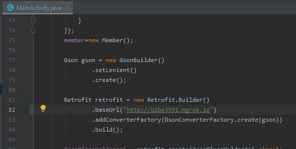

A Text Summarizer App

Do you feel bored of reading big long texts/messages , Well everyone does.

Try to be more productive and utilize your time by reading just the important notes/facts in the messages. Just input any long text/message in the text area as shown in the pictures below and get the short summary  :) 

Firstly Open the app.py file and run the python server.

Now run your ngrok server (First install ngrok) by writing the command 'ngrok.exe http 5000'

Paste the url generated by ngrok inside MainActivity.java as shown below.
And run your app.

 
 
 
 
 
 
 
 
 
 
 
 
 
 
 
 
 
 
 
  
 
 
Note If you get any error while inputting the text or you don't get any summary (as a response) back, then just try to write the text which you want to summarize as it is in the MainActivity.java file inside android folder.
Over there you might see a String txt; on line 162
