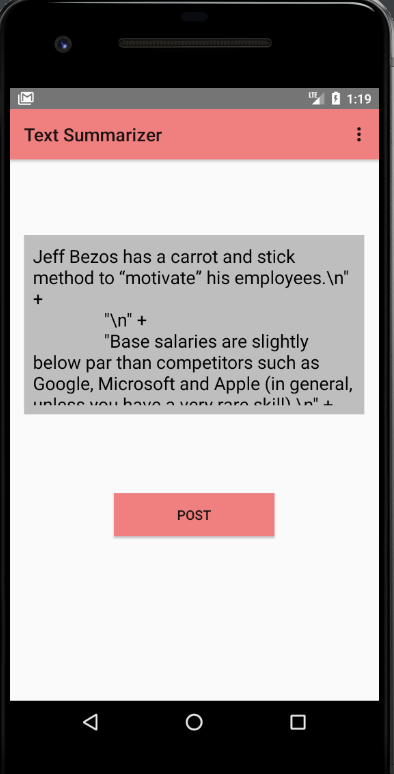
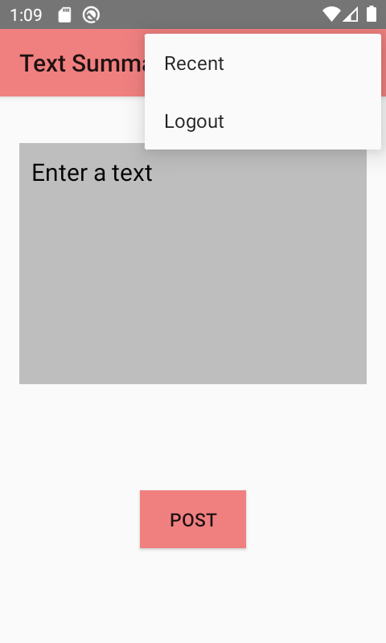

A Text Summarizer App

Do you feel bored of reading big long texts/messages , Well everyone does.

Try to be more productive and utilize your time by reading just the important notes/facts in the messages. Just input any long text/message in the text area as shown in the pictures below and get the short summary  :) 

 
 
 
 
 
 
 
 
 
 
 
 
 
 
 
 
 
 
 
  
 
 

